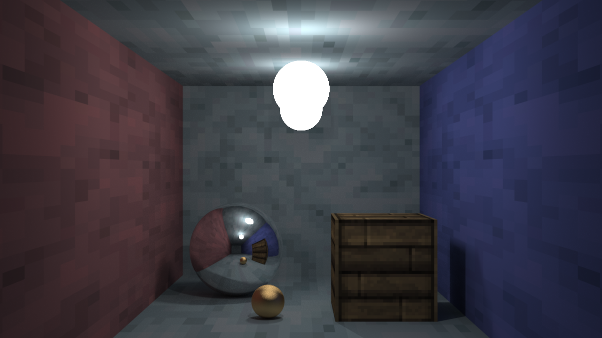

# Corpuscle

Corpuscle is a path tracer.

## Building

Corpuscle is build using [CMake](https://cmake.org/). The only dependency that must be installed is 
[SFML](http://www.sfml-dev.org/), the other dependencies (imgui and glm) are already included within the repository.

## Rendering

Scenes can be loaded from a JSON file, see [data/scene.json](data/scene.json) for an example. The current state can be 
saved to an image file by pressing F2.

## License

Corpuscle is distributed under the [zlib/libpng license](https://opensource.org/licenses/Zlib). See the LICENSE file for
more details.

